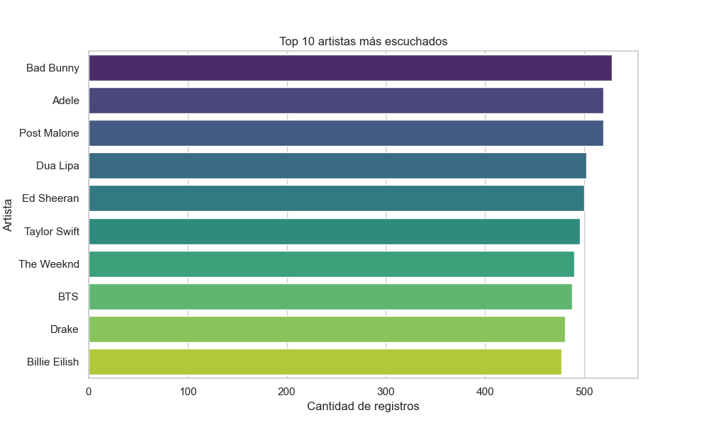
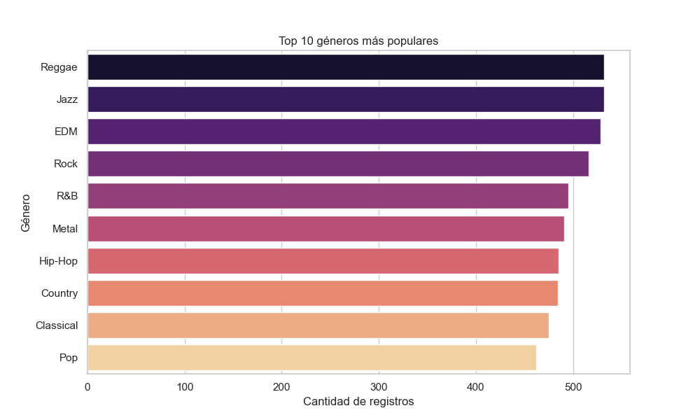
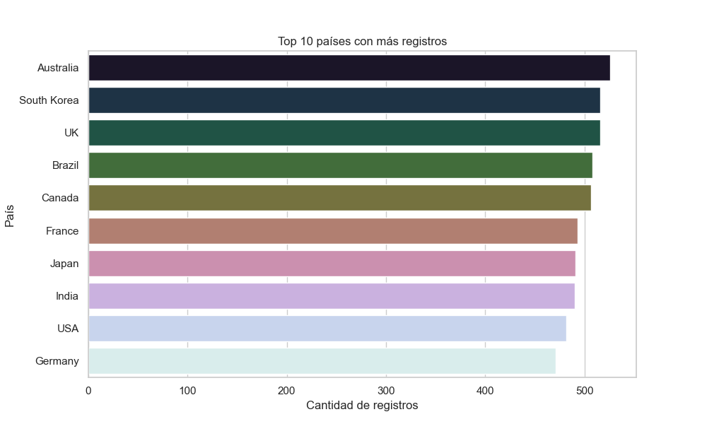

# Music Streaming EDA

## Descripción
Este proyecto realiza un análisis exploratorio de datos (EDA) sobre un dataset de preferencias de escucha en plataformas de streaming musical.  
El objetivo es mostrar habilidades de **Data Engineering y análisis de datos**, incluyendo limpieza de datos, estadísticas descriptivas y visualizaciones.

## Dataset
- Fuente: [Global Music Streaming Trends and Listener Insights - Kaggle](https://www.kaggle.com/datasets/atharvasoundankar/global-music-streaming-trends-and-listener-insights)
- Contiene información sobre usuarios, artistas más reproducidos, géneros, países, minutos escuchados y métricas de interacción.

## Estructura del proyecto

music-streaming-project/
│
├─ data/           ← Dataset original (no subido a GitHub)
├─ notebooks/      ← Notebooks de análisis (01_eda.ipynb)
├─ src/            ← Scripts ETL y transformaciones
├─ output/         ← Gráficos y estadísticas generadas
├─ .gitignore
├─ requirements.txt
└─ README.md

## Análisis realizado
- Limpieza básica de columnas y duplicados.
- Identificación de valores faltantes.
- Estadísticas descriptivas.
- Visualizaciones:
  - Top 10 artistas más escuchados
  - Top 10 géneros más populares
  - Top 10 países con más registros

## Resultados

## Cómo ejecutar
1. Crear entorno virtual y activar:

python -m venv .venv
source .venv/bin/activate  # macOS/Linux
pip install -r requirements.txt

2.	Abrir notebook en Jupyter:

jupyter notebook notebooks/01_eda.ipynb

3.	Ejecutar celdas paso a paso para generar gráficos y estadísticas.

Extensiones posibles
	•	Scripts ETL en src/ para automatizar limpieza y transformaciones.
	•	Consultas avanzadas o integración con AWS S3, Glue o Athena.
	•	Dashboards interactivos con Streamlit o Plotly Dash

